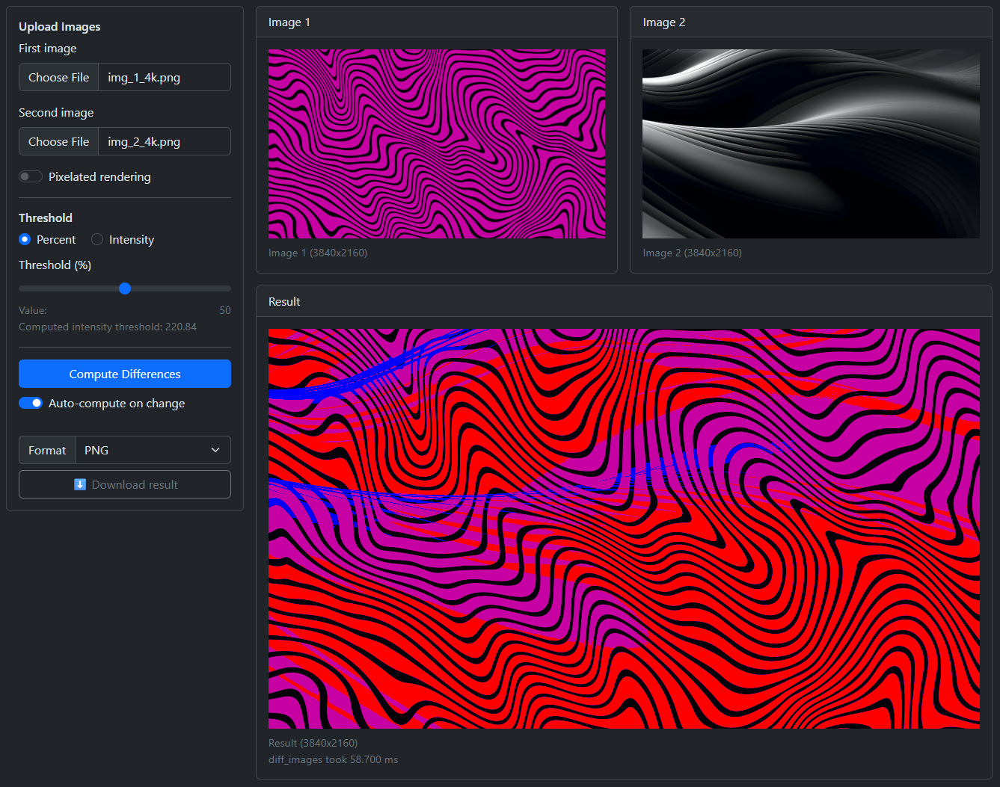

# OZM-AI Labs

A web application for comparing two images and visualizing their differences. Supports image upload, sensitivity threshold adjustment, result format selection, and downloading the diff image.

  

## Launch

1. Open [web/index.html](web/index.html) in your browser.
2. Upload two images.
3. Adjust the threshold and format parameters.
4. Click "Compute Differences" to get the result.
5. Download the result using the "Download result" button.

## Dependencies

- [Bootstrap 5](https://getbootstrap.com/)

