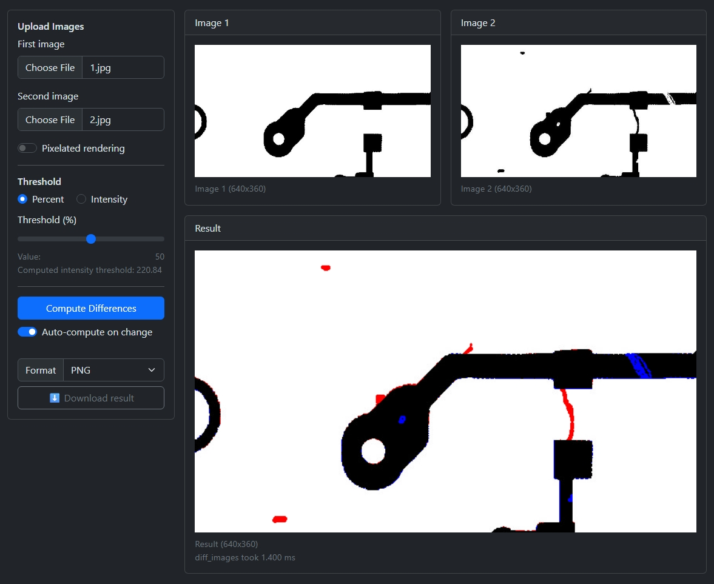

# OZM-AI Labs

A web application for comparing two images and visualizing their differences. Supports image upload, sensitivity threshold adjustment, result format selection, and downloading the diff image.

  

## Launch

1. Just open [https://zdavano.github.io/ozmai_labs/](https://zdavano.github.io/ozmai_labs/) in your browser.
2. Or open [web/index.html](web/index.html) locally in your browser.
3. Upload two images.
4. Adjust the threshold and format parameters.
5. Click "Compute Differences" to get the result.
6. Download the result using the "Download result" button.

